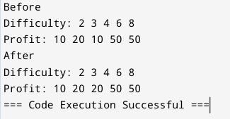

# LeetCode
Daily challenges - June 12/2024

## 1.SortColours(Variation of Dutch National Flag Problem)
**Desription:** Given an array nums with n objects colored red, white, or blue, sort them in-place so that objects of the same color are adjacent, with the colors in the order red, white, and blue.We will use the integers 0, 1, and 2 to represent the color red, white, and blue, respectively.You must solve this problem without using the library's sort function.

**Approach:** Given only "0,1,2" will exist in the array sorting will be such that there is always "0" on the left end and "2" on the right end. So we are using two pointers to ensure 0's end up on the left and 2's end up on the right which will automatically leave 1's in the middle giving us a sorted array.This approach has a time complexity of O(n) and a average runtime of 0ms.
 
>Note:We can also use Bubble sort which had a time complexity O(n2) and average runtime of 4ms.

## 2.Minimum Number of Moves to Seat Everyone(MinimumMoves.java)
**Description:** There are n seats and n students in a room. You are given an array seats of length n, where seats[i] is the position of the ith seat. You are also given the array students of length n, where students[j] is the position of the jth student.You may perform the following move any number of times:
Increase or decrease the position of the ith student by 1 (i.e., moving the ith student from position x to x + 1 or x - 1).Return the minimum number of moves required to move each student to a seat such that no two students are in the same seat.

**Approach:** We can use a counting sort method to solve the problem efficiently. First find the maximum element from both the arrays.Create a difference array of the maximum size.Now to reduce space complexity we'll use this single array where we increment the difference array at each index that matches the value in the seats array and decrement the difference array at each indec that matched the value in the student array.Now we can use the difference array to find the minimum moves.Iterate through the difference array, use a unmatched variable (negative unmathced means a student has no seat and positive unmatched means seats are vacant) now add the value of the difference array to the unmatched. now add the absolute value of the unmatched to the moves variable. Return the moves variable which is the minimum cost.

To learn more about counting sort and how it works. [Reference](https://www.geeksforgeeks.org/counting-sort/ "Counting Sort in GeeksforGeeks").

> Note: We can also use sorting(Arrays.sort) and find the difference between each index value of the arrays to find the minimum moves.

## 3.Minimum Increment to make arrays unique:(UniqueArray.java)
**Description:** You are given an integer array nums. In one move, you can pick an index i where 0 <= i < nums.length and increment nums[i] by 1.Return the minimum number of moves to make every value in nums unique.

**Approach:** Couting can be used to make the array unique,we'll use a frequency array to calculate the frequency of each element in the array and using this array we'll calculate the minimum moves to remove duplicates from the frequency array. Find the maximum element in the array and find create a frequency array of size nums array length + max.Now increment the frequency at each index from the value of the nums array.Traverse through the frequency array and if the value is greater than 1 calculate duplicates by subtracting 1 from the current value of frequency array and add it to the next element of the freqency array and add the duplicates to the number of moves. return the minimum number of moves.

> Note: We can also use Sorting technique but its not efficient and has a large time complexity.

## 4.IPO:(IPO.java)
**Description:** Suppose LeetCode will start its IPO soon. In order to sell a good price of its shares to Venture Capital, LeetCode would like to work on some projects to increase its capital before the IPO. Since it has limited resources, it can only finish at most k distinct projects before the IPO. Help LeetCode design the best way to maximize its total capital after finishing at most k distinct projects.You are given n projects where the ith project has a pure profit profits[i] and a minimum capital of capital[i] is needed to start it.Initially, you have w capital. When you finish a project, you will obtain its pure profit and the profit will be added to your total capital.Pick a list of at most k distinct projects from given projects to maximize your final capital, and return the final maximized capital.

**Approach:** There are two approaches to solving the problem.

**1.Using Array:**
In this approach we create a loop that iterates k times to get the sum of most profitable k distinct projects from the given project capital and profits.At each iteration a nested loop of profits.length iterations is run where we check if the capital required for a project i is less than or equal to the available capital and if the profit is greater than the previous profit which will be tracked by a variable(profit), if so we store the current value of profit replaced in the profit variable and the index is stored in a index variable. After the loop the profit is added to the totalProfit and the value at the index of index variable is replaced with -1 at both the arrays to make sure that we invest twice in no project.
note that the profit and index variable are initiated by -1 at each k iteration.The totalProfit gives the maximum profit that can be obtained.
> Even though this approach seem simple it is not effiecient as it cannot handle large inputs.

**2.Using ArrayList and PriorityQueue:**
In this approach we create a Arraylist to store the values of the two arrays using Map.Entry().Then we sort the Arraylist based on the capital as it is the criteria to compare with the profit variable and iterating through the sorted array is a best option to avoid complications in traversing the array.Now create a priority Queue and set it in Collection.reverseOrder() to make the Queue use it as maxHeap(this is a custom Comparator).Now declare a loop of k iteration, at each iteration create a nested loop and iterate it until the capital in the ArrayList is less than or equal to the totalProfit (Note that we are iterating through the capital until its less than the totalProfit to get all the possible projects for the current totalProfit,that is why we need to sort the ArrayList Based on capital).if yes add the corresponding profit to the PriorityQueue.If the PriorityQueue size is zero that is it has no entry then we can break the program and return the current totalProfit as it means that there is no project that can be done further with the current profit. If no then pop the top element of the queue and add it to the totalProfit as the queue uses maxheap the top element is the maximum element which means it is the maximum profit that can be earned with the current totalProfit.We are using a queue because it can hold the old data and the new eligible projects are only needed to be added which significantly improve the performance at the worst case.It is important to note that it can handle large inputs too.
> To Learn more about the approach [refer](https://youtu.be/u07eLf-s6TU?si=tpTVlcviprdip_kz "IPO solved using PriorityQueue by Aryan Mittal"). Credits to [AryanMittal](https://www.youtube.com/@ARYANMITTAL) for Solving the problem.

## 5.PatchingArray:(PatchingArray.java)
**Description:** Given a sorted integer array nums and an integer n, add/patch elements to the array such that any number in the range [1, n] inclusive can be formed by the sum of some elements in the array.Return the minimum number of patches required.

**Approach:** We know that the array is sorted and the sum of subsets of the array should return the range of numbers from 1 to n. To achieve this we use a maxPossible variable which denotes the maxPossible number that can be achieved using the numbers traversed so far. Create a loop that check if the maxPossible is less than n and at each iteration increment the maxPossible variable by 1 and if the resultant is greater than or equal to the nums[i] because if the maxPossible is less than the variable then we cannot achieve that number by adding that nums[i], so if the condition is false then it means that we have to patch a number to the array so increment minPatch and increment the maxPossible by (maxPossible + 1 ) as now a new MaxPossible + 1 variable is added to the array and its sum gives the maxPossible value. And if the condition is true then add that nums[i] value to the maxPossible and increment i to check the next value in the array. The loop breaks once the maxPossible value is greater than n which means the array can now give the range of 1 to n when the subset of the array are added.

>To learn more about the approach [refer](https://youtu.be/6s97yEBQaGQ?si=uoL4RSOsEiWGQCIR "PatchingArray Solved by Aryan Mittal"). Credits to [AryanMittal](https://www.youtube.com/@ARYANMITTAL) for Solving the problem.

## 6.Sum of Square Numbers:(SumofSquare.java)
**Description:** Given a non-negative integer c, decide whether there're two integers a and b such that a2 + b2 = c.

**Approach:** As we already know that c is the sum of square of two numbers we can also assume that **b2 = c - a2**. Declare a loop from 0 and check if the square of the number is less than c to make sure it doesnt exceed the sum and at each iteration find the square root of **b2** using the above formula.Now check if the square root is gives a complete number by checking if its equal to the integer equivalent of the number.If so return true else if the loop exceed the condition print false.

## 7.Most Profit Assigning Work:(MostProfit.java)
**Description:** You have n jobs and m workers. You are given three arrays: difficulty, profit, and worker where difficulty[i] and profit[i] are the difficulty and the profit of the ith job, and worker[j] is the ability of jth worker (i.e., the jth worker can only complete a job with difficulty at most worker[j]).Every worker can be assigned at most one job, but one job can be completed multiple times.

**Approach:** We are aware that the workers are limited to a certain ability. So in order to get the maximum profit let us use the maximum ability from the workers array. Declare a array jobs of size maximum ability + 1.Now the maximum ability comes handy, create a loop of size difficulty array and for each iteration check if each element of difficulty is less than or equal to the maximum ability of the workers, this way we can avoid the works that has a higher difficulty than the workers can perform and for each of these difficulties insert the maximum of the value at jobs where index is the difficulty and the profit of the respective work i.Now let us find the maxima of the job elements. This is to find get the maximum profit for a certain range of works.Let us see how it works visually.

As we can see if we have the workers ability as 4 then from the maxima array we can find that the maximum profit is 20. Similarly we'll change the jobs array and create a loop to traverse the worker array and find the maximum profit work for each worker add them and return.

>Note: There is yet another to solve this problem by combining difficulty and profit array in a ArrayList and sorting them based on the difficulty and also sorting the worker array. Now for each worker ability we'll find the maximum profit using the ArrayList.For More detail analysis [refer](https://youtu.be/V-gYS2b8Ux0?si=NB7Gjsz2fDPiCnge "Most Profit Assigning Work Solved by Aryan Mittal"). 

## 8.Minimum Number of days to make m Bouquets:(MinimumBouquet.java)
**Description:** You are given an integer array bloomDay, an integer m and an integer k.You want to make m bouquets. To make a bouquet, you need to use k adjacent flowers from the garden.The garden consists of n flowers, the ith flower will bloom in the bloomDay[i] and then can be used in exactly one bouquet.Return the minimum number of days you need to wait to be able to make m bouquets from the garden. If it is impossible to make m bouquets return -1.

**Approach:** To find the minimum number of days we can use Binary search as the number of Bouquets that can be made increase with days. So we first find the maximum number of days that a flower takes to bloom and save it as rear and keep the low as 1 at first. Declare a loop that check if the low is not exceeding the rear and at each iteration we calculate the mid by [mid = (low+rear)/2] and check if the mid day satisfies the condition that is if it can produce a m bouquet with k flowers using a function.If yes then we take the mid as ans and decrease the rear to mid-1 to if the same can be achieved in much less number of days. else we increase the low to mid+1 to check if the condition can be satisfied in much higher days.and return the answer. Inside the Function We iterate through the bloom day array and check if the elements are less than the mid value if so then there are consecutive flowers to make a bouquet so we increment a variable consecutiveCount if the consecutive count reaches k then we increment the numberofBouquets and make the consecutiveCount 0. if the bloomday is greater than the mid then we make the consecutiveCount 0.The function returns a boolean for the condition numberofBouqutes == m.

> Note: To learn more about the approach in detail [refer](https://youtu.be/w24SIuukcZI?si=fUnA1SUdtJEHsRmO "Minimum number days to make m Bouqutes Solved by AryanMittal"). Credits to [AryanMittal](https://www.youtube.com/@ARYANMITTAL) for Solving the problem.
